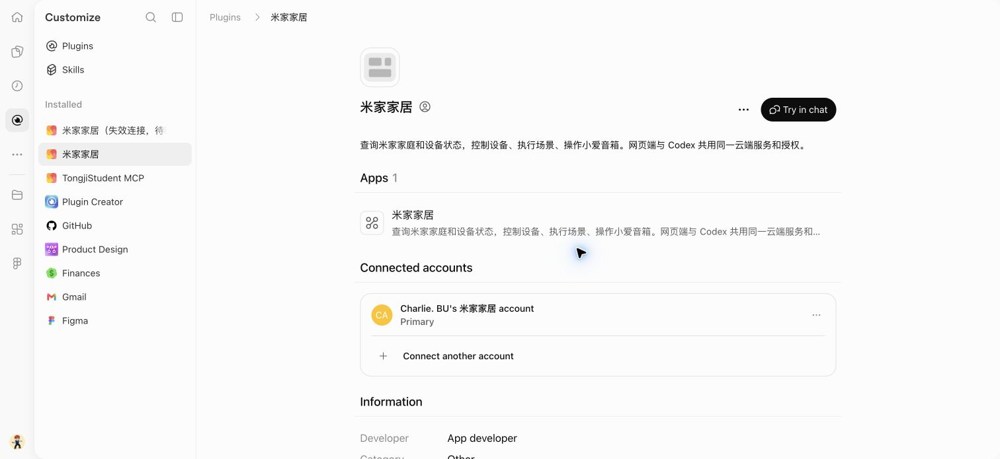
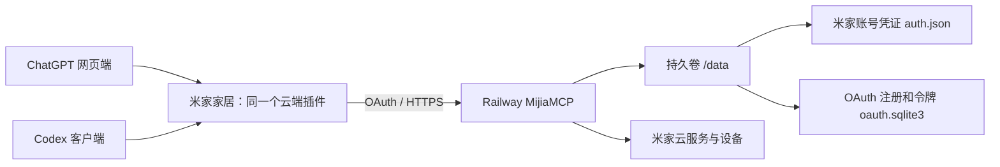
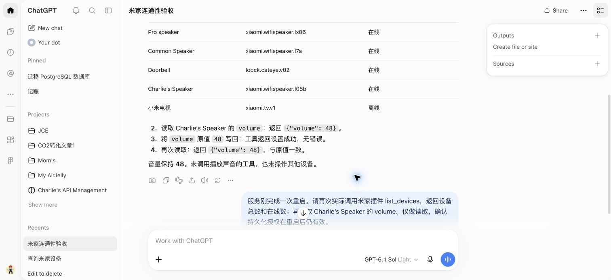
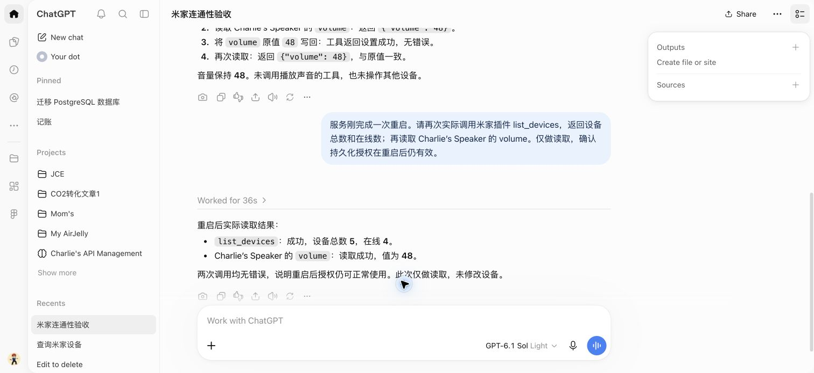

# 米家插件认证修复与双端验收报告

验收日期：2026-10-03（Asia/Shanghai）  
代码仓库：<https://github.com/Charlie-BU/MijiaMCP>  
生产服务：`https://mijiamcp-production.up.railway.app/mcp`

## 1. 结果

**ChatGPT 网页端与当前 Codex 客户端均已实际成功调用米家工具，设备读取和设备属性写入均通过。** Railway 服务重启后，两端仍能正常使用。

最终使用一个原生云端插件“米家家居”，通过 OAuth 连接同一台 Railway MCP 服务。该插件支持网页端，不依赖本机启动脚本或桌面专用 MCP 包。重复的 Codex 本地 `mcp_servers.mijia` 直连配置已移除。

| 项目 | 结果 |
|---|---|
| 网页端 OAuth 授权 | 成功；页面显示已连接，认证方式为 OAuth |
| 网页端查询设备 | 成功：5 台设备，4 台在线、1 台离线 |
| 网页端控制设备 | 成功：音箱音量读取 48 → 原值写回 48 → 再读回 48 |
| 当前 Codex 对话调用 | 设备列表、规格、音量读取和原值写回均成功 |
| Codex 统一云端插件 | `enabled=true`、`callable=true`，发现全部 14 个工具 |
| 移除本地直连后的 Codex 云端调用 | 成功：通过新插件完成音量读取、原值写回及读回 |
| 服务重启后的网页调用 | 成功：设备总数 5、在线 4、音量 48 |
| 服务重启后的 Codex 云端调用 | 成功：音量读取、原值写回和读回均成功 |
| 自动化测试与静态检查 | 34 项测试通过；Ruff lint 和 format 检查通过 |
| GitHub / Railway | 修复已推送 `main`；Railway 最新部署 Active |
| 旧插件目录记录清理 | 待执行时确认：两个旧记录已失效或停用，新插件已正常工作 |

控制验收使用“写回当前音量”的方式验证真实写接口，设备音量始终保持 48；没有调用播放、开锁或场景执行等额外动作。

## 2. 最终插件与服务标识

| 配置 | 最终值 |
|---|---|
| 插件名称 | 米家家居 |
| 插件类型 | ChatGPT 原生云端 MCP 插件 |
| 插件 ID | `plugin_asdk_app_6ac0a93d8de88191837db7163ce340f8` |
| App ID | `asdk_app_6ac0a93d8de88191837db7163ce340f8` |
| App 版本 ID | `asdk_app_v_6ac0a93d8e188191b0d2c59c1bdb54e2` |
| MCP 地址 | `https://mijiamcp-production.up.railway.app/mcp` |
| 认证 | OAuth Authorization Code + S256 PKCE |
| 客户端注册 | Dynamic Client Registration（DCR） |
| 权限范围 | `mijia` |
| Railway 数据目录 | `/data` |
| Railway Volume | `mijiamcp-volume`，挂载 `/data` |
| 数据文件 | `/data/auth.json`、`/data/oauth.sqlite3` |
| 两个凭证文件权限 | 均为 `0600` |

[打开最终插件](https://chatgpt.com/plugins/plugin_asdk_app_6ac0a93d8de88191837db7163ce340f8) · [查看网页验收对话](https://chatgpt.com/c/6ac0a985-b68c-83e9-8f44-0c07b9e4d0f5)





API Key 仍用于服务所有者在授权页确认授权。客户端随后使用 OAuth 令牌，不需要把这个 Key 写入插件包。本报告不包含 API Key、OAuth 令牌、米家登录凭证、设备 token、IP 或 MAC。

## 3. 为什么原来的授权一直失败

这次不是单一的 Key 错误，而是三个相互独立的问题，加上旧连接缓存，依次阻断了完整链路。

### 3.1 浏览器提交产生 `Origin: null`

原授权页面设置了 `Referrer-Policy: no-referrer`。在实际 Chromium 浏览器中，授权表单 POST 因此携带 `Origin: null`。服务端严格检查来源，只接受同源请求或缺省 Origin，于是先返回 403，尚未进入 API Key 校验。

这解释了为什么继续输入有效 Key 也无法成功。普通 HTTP 测试客户端不会自动复现浏览器的这项策略，因此必须使用真实浏览器验证。

**修复：** 改为 `Referrer-Policy: same-origin`。同源授权 POST 保留正确来源信息，跳转到 ChatGPT 的跨源回调时仍不发送 Referer。没有放宽为接受 `Origin: null` 或任意来源。

### 3.2 CSP 阻止 OAuth 跨站回调

原页面的 CSP 只允许 `form-action 'self'`。修好来源问题后，服务端虽然成功签发授权码并返回 302，但 Chromium 会将 `form-action` 检查应用于表单提交后的跳转链，阻止跳转到 ChatGPT 回调地址。

**修复：** 按当前请求已注册、已校验的回调地址生成 CSP，只加入该回调的 origin。例如本次连接允许 `https://chatgpt.com`。仍保留 `default-src 'none'`、`frame-ancestors 'none'`，并拒绝回调 hostname 中的通配符或 CSP 特殊字符。

### 3.3 Railway 没有持久卷，部署会丢失状态

排查时确认服务原先使用 `MIJIA_DATA_DIR=./.data`，未挂载 Railway Volume。部署替换容器后，临时文件系统中的米家凭证和 OAuth 数据库会一并丢失。

实际出现过上游日志“认证文件不存在: .data/auth.json”。它影响两个不同层面：

1. 米家账号凭证丢失，MCP 即使连上也无法访问设备。
2. OAuth 客户端注册丢失，ChatGPT 保存的客户端 ID 和密钥在服务端不再存在。

**修复：** 创建并挂载 `/data` 持久卷，将 `MIJIA_DATA_DIR` 改为 `/data`；恢复本机已有、经只读 API 验证有效的米家凭证。新增启动保护：Railway 环境没有持久卷，或数据目录落在卷外时，服务拒绝启动，避免再次以易丢失的状态上线。

### 3.4 旧 ChatGPT 连接复用已经丢失的 DCR 注册

即使修复服务器并恢复米家账号凭证，原有 ChatGPT 连接仍使用此前注册的 OAuth 客户端信息。服务器已没有对应记录，重新输入 API Key 无法重建这个注册。

当前页面不提供对现有连接认证配置的编辑入口，原始 OAuth 数据库也没有可用备份，因此重建了连接。新 DCR 注册和授权数据已写入 `/data/oauth.sqlite3`，并通过重启回归验证。

ChatGPT 会保存并复用 DCR 产生的客户端凭证，这与官方说明一致；官方排障建议对既有连接恢复原客户端注册和密钥。[OpenAI 认证文档](https://developers.openai.com/plugins/build/auth)、[OpenAI 部署排障文档](https://developers.openai.com/plugins/deploy/troubleshooting)

## 4. 代码变更与部署

### 4.1 已推送的提交

| 提交 | 内容 |
|---|---|
| [`04f42b4`](https://github.com/Charlie-BU/MijiaMCP/commit/04f42b40181cf5a043b9a552ae9c91dc9ac1aa5f) | 修复浏览器 Origin 与回调 CSP；补充浏览器回归脚本和测试 |
| [`d4b0405`](https://github.com/Charlie-BU/MijiaMCP/commit/d4b0405883c37350adc803dde35b6934d728bc7e) | 强制 Railway 凭证与 OAuth 状态使用持久卷 |

最终本地 HEAD 与 GitHub `main` 均为：

```text
d4b0405883c37350adc803dde35b6934d728bc7e
```

工作区检查为空，没有遗留未提交源码修改。相对于本轮修复前的 `747a1f3`，共修改 6 个文件，新增 247 行、删除 5 行。

### 4.2 文件说明

| 文件 | 变更 |
|---|---|
| `src/oauth.py` | 同源 Referrer 策略、按回调生成 CSP、回调 hostname 校验 |
| `src/server.py` | 自动采用 Volume 路径，校验 Railway 持久化配置 |
| `tests/test_oauth.py` | 同源提交、允许/拒绝回调、特殊字符等回归测试 |
| `tests/test_server.py` | 缺卷、卷外目录和正确路径的启动校验 |
| `scripts/oauth_browser_smoke.py` | 使用虚构 Key 和临时数据的真实浏览器 OAuth 验收脚本 |
| `README.md` | Railway 持久化配置、丢失注册的恢复办法、浏览器回归说明 |

### 4.3 Railway 最终状态

| 项目 | 值 |
|---|---|
| 环境 | production |
| 服务 | MijiaMCP |
| 最终部署 ID | `05f2ec22-bace-4a20-83ec-0dc7dc1d8a06` |
| 部署结果 | Active / Deployment successful |
| 持久卷 ID | `2d6759de-67f4-4f06-887c-93524c0c62e4` |
| `MIJIA_DATA_DIR` | `/data` |
| `RAILWAY_VOLUME_MOUNT_PATH` | `/data` |
| `/health` | HTTP 200，`{"status":"ok"}` |
| 未认证 MCP POST | HTTP 401，包含 OAuth resource metadata challenge |

[查看最终 Railway 部署](https://railway.com/project/18538793-8504-4734-8faf-36258cee02b3/service/6d721d96-ff1a-4ec9-8697-deee60eea1e5?environmentId=c0c0335b-ee05-41d8-a525-34ee50672e52&id=05f2ec22-bace-4a20-83ec-0dc7dc1d8a06#deploy)

注意：当前 MCP 使用 Streamable HTTP 的 JSON 响应模式，直接在地址栏 GET `/mcp` 可返回 405；这不表示 MCP 认证或工具调用失败。实际 MCP POST 与客户端调用已经单独验证。

## 5. 两端功能验收

### 5.1 网页端

通过最终原生云端插件的“Try in chat”入口，在真实 ChatGPT 网页聊天中执行了以下调用：

1. `list_devices`：成功列出 5 台设备。
2. `get_device_properties`：读取 `Charlie’s Speaker` 的 `volume`，返回 48。
3. `set_device_property`：把该属性按原值 48 写回，返回成功。
4. `get_device_properties`：再次返回 48，写后读取一致。

| 设备 | 型号 | 当时状态 |
|---|---|---|
| Pro speaker | `xiaomi.wifispeaker.lx06` | 在线 |
| Common Speaker | `xiaomi.wifispeaker.l7a` | 在线 |
| Doorbell | `loock.cateye.v02` | 在线 |
| Charlie’s Speaker | `xiaomi.wifispeaker.l05b` | 在线 |
| 小米电视 | `xiaomi.tv.v1` | 离线 |

电视离线是米家返回的设备状态，其他设备读取和控制已正常，不能将这一个离线状态解释为插件授权失败。



### 5.2 当前 Codex 客户端及统一云端路径

本 Codex 对话已实际调用设备列表、设备规格、音量读取及写入工具，结果成功。为避免仅凭旧直连工具缓存判定成功，又进行了独立的统一云端路径验证：

- 使用本机 Codex app-server 的 `app/read` 获取新 App 的 14 个工具。
- 使用 `app/installed` 确认该 App 已启用且可调用。
- 通过 app-server 的 `mcpServer/tool/call` 调用 `codex_apps` 下的新 App 工具。
- 在移除本地 `mcp_servers.mijia` 配置后，完成音量“48 → 写回 48 → 读回 48”。

该验证使用临时工具测试上下文，没有另起模型代理任务。它走当前登录账号的正式 Codex 云端插件运行时，不是直接向 MCP 发送 API Key 的替代测试。

可查阅保存的[Codex 插件发现结果](./mijia-verification/codex-plugin-check.jsonl)。其中插件名称已是最终名称“米家家居”。

### 5.3 重启后的回归

在新插件已授权后，通过 Railway 重启当前生产部署，再执行：

| 端 | 重启后结果 |
|---|---|
| ChatGPT 网页 | `list_devices` 成功：总数 5、在线 4；音量读取为 48 |
| Codex 云端插件 | 读取 48，写回 48 成功，再读回 48 |

随后通过 Railway Console 只核对目录、文件名和权限，确认 `auth.json` 与 `oauth.sqlite3` 仍在 `/data`，两者均为 `0600`。没有读取或输出文件中的秘密值。



### 5.4 已发现的完整工具清单

| 工具 | 用途 |
|---|---|
| `list_homes` | 查询家庭与房间 |
| `list_devices` | 查询设备列表 |
| `list_scenes` | 查询手动场景 |
| `list_consumables` | 查询耗材 |
| `get_device_spec` | 查询设备属性和动作规格 |
| `get_device_properties` | 读取设备属性 |
| `set_device_property` | 写入设备属性 |
| `run_device_action` | 执行设备动作 |
| `run_scene` | 执行手动场景 |
| `get_statistics` | 查询设备统计数据 |
| `run_speaker_command` | 通过小爱音箱执行自然语言命令 |
| `speaker_play` | 通过小爱音箱朗读文本 |
| `login` | 发起米家二维码登录 |
| `login_status` | 查询二维码登录结果 |

## 6. 自动化与浏览器回归

已运行：

```bash
uv run --locked pytest -q
uv run --locked ruff check .
uv run --locked ruff format --check .
```

结果：**34 项测试通过；Lint 和格式检查通过。**

覆盖范围包括认证发现、有效/无效 API Key、所有者确认后才签发 OAuth 令牌、授权码和令牌过期、回调和资源绑定、错误客户端、Key 轮换、Cookie/CSRF、Origin、回调 CSP、客户端注册校验、持久卷配置，以及米家扫码登录后的凭证加载流程。

另外使用真实 Chrome 执行了本地浏览器 OAuth 冒烟测试。测试采用虚构 Key、临时数据库，回调在 `localhost` 与 `127.0.0.1` 之间跨源跳转；最终成功完成换码并取得 14 个工具。该测试复现并验证了 HTTP 单元测试无法自动模拟的浏览器 Origin/CSP 行为。临时服务器已停止。

以后可在仓库内运行：

```bash
uv run --locked python scripts/oauth_browser_smoke.py
```

按照终端提示打开 `http://localhost:8927/start`，使用脚本显示的测试专用 Key。成功页应显示 `Browser OAuth passed` 和 `14 tools`。无需使用真实生产密钥。

## 7. 安全边界与测试范围

本次修复保留了以下机制：

- 现有 API Key 的恒定时间摘要比较；Key 不放入插件配置。
- 来源检查、Cookie 与 CSRF 校验；没有接受任意 Origin。
- S256 PKCE、授权码单次使用、回调校验。
- 访问令牌绑定 `/mcp` 资源与 `mijia` scope。
- 访问令牌 1 小时、刷新令牌 30 天；刷新轮换和重放撤销。
- 授权码、访问令牌、刷新令牌在数据库中使用摘要标识；数据库本身仍是敏感文件，因为还包含 OAuth 客户端注册信息。
- 米家凭证与 OAuth 数据库以 `0600` 权限保存。

本次验证证明了授权、工具发现、实际读写和重启恢复链路。没有逐一执行所有 14 个工具的实际动作，例如场景执行、语音播报、统计查询和重新扫码登录；也没有控制离线电视。短时验收不能代替未来令牌刷新和米家服务可用性的持续运行情况。

本实现的 OAuth 客户端注册保留期当前为 365 天；访问/刷新令牌有上述单独有效期。持久卷可以避免部署丢失状态，但不会取消协议中的过期机制。

## 8. 日常使用与故障恢复

### 正常使用

在网页端或 Codex 中选用“米家家居”，例如：

> 查询我的米家设备状态。
>
> 查看 Charlie’s Speaker 的音量。

控制请求应明确设备和目标属性。客户端按照自身的工具权限策略执行或请求确认。

### 更新代码

提交并推送仓库 `main` 后，Railway 自动部署。保留 `/data` Volume、`MIJIA_DATA_DIR=/data` 和现有认证变量。不要将生产数据目录改回 `./.data`，也不要用空数据库覆盖已有 `oauth.sqlite3`。

服务新增或变更工具后，可在插件设置中使用 `Refresh tools` 更新客户端元数据。[OpenAI 连接与更新文档](https://developers.openai.com/plugins/deploy/connect-chatgpt)

### 米家账号失效

MCP 已授权但米家接口提示凭证失效时，使用 `login` 发起二维码，再用米家 App 扫码并调用 `login_status` 确认。OAuth 连接与米家账号登录属于两层独立认证。

### OAuth 注册或数据库丢失

优先从备份恢复原 `/data/oauth.sqlite3`。ChatGPT 会复用旧客户端凭证；仅重试 API Key 不会恢复丢失的注册。如果没有数据库备份，需要重建客户端连接。本次没有通过伪造旧客户端、取消客户端密钥或放宽鉴权来绕过这一要求。

### API Key 轮换

从 `ALLOWED_API_KEYS` 移除一个 Key 后，基于该 Key 授予的 OAuth 令牌也会失效，需要客户端重新授权。轮换前应考虑正在使用的连接。

持久卷是本次已完成的配置；额外的自动备份计划没有在本次任务中启用。备份时应保护整个 `/data`，不要把凭证文件提交到 GitHub。

### 本机调试工具与清理

本地浏览器冒烟测试服务已停止，临时测试页面已关闭。调试过程中通过 Homebrew 安装了 Railway CLI 5.49.2；未完成其额外 OAuth 授权，最终部署管理与凭证恢复均通过已有 Railway 网页会话完成。CLI 卸载时 Homebrew 元数据请求持续等待，已中止等待；该 CLI 目前仍留在本机，不参与最终插件运行。

## 9. 旧入口清理状态

当前可用的正式插件为 App `asdk_app_6ac0a93d8de88191837db7163ce340f8`。

待永久删除的两个旧目录记录：

| 旧记录 | ID | 状态 |
|---|---|---|
| 米家家居（失效连接，待移除） | `plugin_asdk_app_6ac09e1183a48191b4da796f04a71618` | 原 DCR 注册已丢失，新连接已替代 |
| 米家家居（旧版，已停用） | `plugins_6ac09382b1288191951f6d0c1815ba71` | 旧封装已停用 |

本地重复直连配置已移除。云端永久删除页面明确提示不可撤销，浏览器工具要求在执行时单独确认，因此最后的两条旧目录记录清理正在等待确认；它不影响已通过验收的新插件。

## 10. 可核查材料

- [浏览器授权修复提交](https://github.com/Charlie-BU/MijiaMCP/commit/04f42b40181cf5a043b9a552ae9c91dc9ac1aa5f)
- [持久化保护提交](https://github.com/Charlie-BU/MijiaMCP/commit/d4b0405883c37350adc803dde35b6934d728bc7e)
- [最终插件页面](https://chatgpt.com/plugins/plugin_asdk_app_6ac0a93d8de88191837db7163ce340f8)
- [网页实际工具验收对话](https://chatgpt.com/c/6ac0a985-b68c-83e9-8f44-0c07b9e4d0f5)
- [Codex 插件发现与可调用状态](./mijia-verification/codex-plugin-check.jsonl)
- 本报告内嵌的网页控制及重启回归截图。
